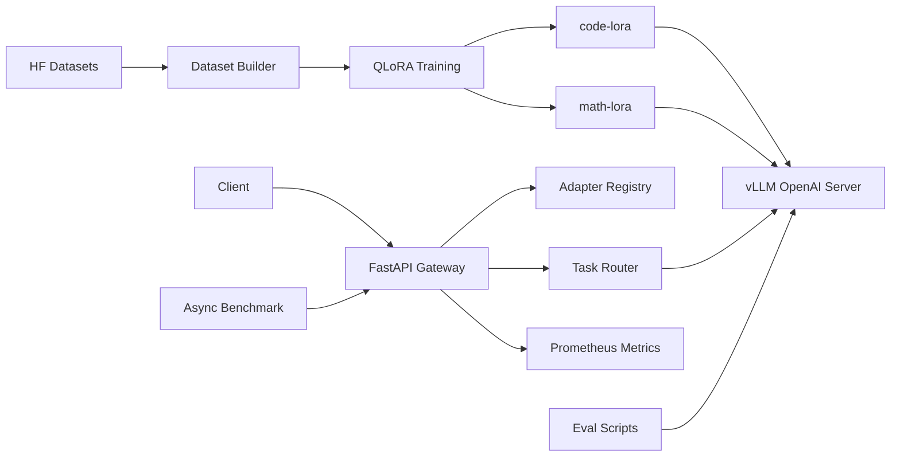

# TaskLoRA-Serve

TaskLoRA-Serve is a low-cost, production-style LLM engineering project that connects multi-task QLoRA fine-tuning, evaluation, vLLM LoRA serving, routing, benchmarking, and Prometheus metrics.

The V1 scope is intentionally focused:

- `code-lora`: trained on `sahil2801/CodeAlpaca-20k`
- `math-lora`: trained on `openai/gsm8k`
- Code eval: `google-research-datasets/mbpp`
- Base model: `Qwen/Qwen2.5-1.5B-Instruct`
- Serving: vLLM OpenAI-compatible API with LoRA modules
- Gateway: FastAPI task router with Prometheus metrics

## Why This Project

Most portfolio LLM projects stop at RAG or API wrapping. This project targets AI Infra work: adapter lifecycle, OpenAI-compatible serving, task routing, latency/throughput measurement, and observability. The training side is small enough to run on a low-cost single GPU, but complete enough to discuss data formatting, QLoRA, base-vs-adapter eval, and failure cases.

## Architecture



## Environment

Use Python 3.10 or 3.11 for training and vLLM serving.

```bash
python -m venv .venv
source .venv/bin/activate
pip install -r requirements.txt
```

For GPU training, install a PyTorch build that matches your CUDA version before installing the rest of the requirements.

## 1. Build Datasets

```bash
python -m training.build_dataset --task all --output-dir data/processed
```

Fast smoke run:

```bash
python -m training.build_dataset --task all --code-limit 100 --math-limit 100 --output-dir data/processed_smoke
```

Outputs:

- `data/processed/code_train.jsonl`
- `data/processed/code_valid.jsonl`
- `data/processed/code_test.jsonl`
- `data/processed/math_train.jsonl`
- `data/processed/math_valid.jsonl`
- `data/processed/math_test.jsonl`

## 2. Train QLoRA Adapters

Smoke training on a tiny sample:

```bash
python -m training.train_qlora --config configs/code_lora.yaml --max-train-samples 10 --max-eval-samples 5 --max-steps 1
python -m training.train_qlora --config configs/math_lora.yaml --max-train-samples 10 --max-eval-samples 5 --max-steps 1
```

Full V1 training:

```bash
python -m training.train_qlora --config configs/code_lora.yaml
python -m training.train_qlora --config configs/math_lora.yaml
```

Expected adapter directories:

- `outputs/code-lora/`
- `outputs/math-lora/`

## 3. Evaluate

Math exact-match eval on GSM8K:

```bash
python -m evaluation.eval_math --config configs/eval.yaml --model base --limit 200
python -m evaluation.eval_math --config configs/eval.yaml --model math-lora --adapter-path outputs/math-lora --limit 200
```

Code pass@1 eval on MBPP:

```bash
python -m evaluation.eval_mbpp --config configs/eval.yaml --model base --limit 50
python -m evaluation.eval_mbpp --config configs/eval.yaml --model code-lora --adapter-path outputs/code-lora --limit 50
```

Run the configured base-vs-LoRA comparison:

```bash
python -m evaluation.eval_base_vs_lora --config configs/eval.yaml
```

## 4. Start vLLM Multi-LoRA Serving

Example command:

```bash
python -m vllm.entrypoints.openai.api_server \
  --model Qwen/Qwen2.5-1.5B-Instruct \
  --host 0.0.0.0 \
  --port 8001 \
  --enable-lora \
  --lora-modules code-lora=outputs/code-lora math-lora=outputs/math-lora
```

If Multi-LoRA setup is blocked by environment constraints, start base serving first and keep the Gateway path unchanged:

```bash
python -m vllm.entrypoints.openai.api_server \
  --model Qwen/Qwen2.5-1.5B-Instruct \
  --host 0.0.0.0 \
  --port 8001
```

In V1, `code` and `math` tasks use LoRA module names (`code-lora`, `math-lora`), while `general` uses the base model serving name configured in `configs/serving.yaml`.

## 5. Start Gateway

```bash
uvicorn serving.gateway:app --host 0.0.0.0 --port 8000
```

Example request:

```bash
curl http://localhost:8000/v1/task/chat \
  -H "Content-Type: application/json" \
  -d '{
    "task": "math",
    "messages": [{"role": "user", "content": "A train travels 60 miles in 2 hours. What is its speed?"}],
    "max_tokens": 256,
    "temperature": 0.2
  }'
```

Useful endpoints:

- `GET /health`
- `GET /adapters`
- `GET /metrics`

## 6. Benchmark

```bash
python -m benchmark.loadgen \
  --config configs/benchmark.yaml \
  --url http://localhost:8000/v1/task/chat \
  --concurrency 4 \
  --duration 60 \
  --output benchmark/results/v1_c4.jsonl

python -m benchmark.analyze_results benchmark/results/v1_c4.jsonl
```

Metrics to report:

- requests/sec
- tokens/sec
- p50 / p95 / p99 latency
- error rate
- adapter distribution
- base vs LoRA latency overhead

## Smoke Checks

These checks do not require a GPU:

```bash
python tests/smoke_test.py
python -m compileall training registry serving evaluation benchmark tests
python -m scripts.validate_project
```

## Read The Code

Start with [PROJECT_CODE_GUIDE.md](PROJECT_CODE_GUIDE.md). It explains the directory layout, the runtime data flow, and the recommended reading order.

For the complete experiment checklist and every command to run, read [EXPERIMENT_PLAN.md](EXPERIMENT_PLAN.md).

## Local No-GPU Demo

Use [RUNBOOK.md](RUNBOOK.md) for the full run order. The short version:

```bash
pip install -r requirements-gateway.txt
python -m serving.mock_vllm --host 0.0.0.0 --port 8001
uvicorn serving.gateway:app --host 0.0.0.0 --port 8000
python -m benchmark.loadgen --config configs/benchmark.yaml --concurrency 2 --duration 10 --output benchmark/results/mock_c2.jsonl
```

This validates Gateway routing, metrics, and benchmark plumbing without a GPU. It does not replace real vLLM benchmark results.

Docker Compose mock demo:

```bash
docker compose -f deploy/docker-compose.yaml up
```

## Resume Bullets

```text
Built TaskLoRA-Serve, a multi-task LoRA serving system that fine-tunes code and math adapters on Qwen2.5-1.5B-Instruct using QLoRA, evaluates base vs adapter quality on GSM8K/MBPP, and serves adapters through a FastAPI gateway backed by vLLM.

Implemented task-aware adapter routing, async serving benchmarks, and Prometheus metrics to measure p95/p99 latency, tokens/sec, error rate, and adapter-level request distribution under mixed code/math workloads.
```
