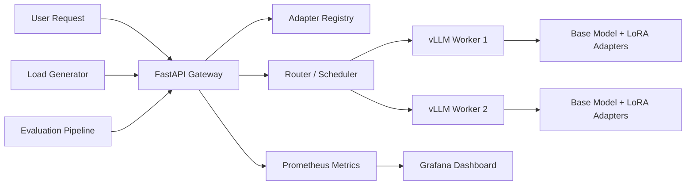

# CodeLoRA-Serve 项目实施文档

## 0. 项目定位

### 项目名称

**CodeLoRA-Serve：面向代码大模型的多 LoRA 微调、评测与高性能推理系统**

英文名：

**CodeLoRA-Serve: A Multi-LoRA Fine-tuning, Evaluation and Inference Optimization System for Code LLMs**

---

## 1. 项目目标

这个项目不是普通的 RAG、Agent 或聊天机器人，而是一个完整的大模型工程化项目，目标是覆盖：

1. 大模型微调：SFT、LoRA、QLoRA、数据构造、训练参数、模型版本管理。
2. 大模型评测：base model vs LoRA model，HumanEval、MBPP、自建 bug-fix/code-review benchmark。
3. 推理系统：vLLM / SGLang，Multi-LoRA Serving，OpenAI-compatible API。
4. AI Infra：Gateway、Router、Scheduler、KV-cache / prefix-cache aware routing、压测、监控。
5. 工程交付：Docker、Prometheus、Grafana、README、实验报告、简历 bullet。

最终要让面试官看到：

> 我不只是会调用大模型 API，而是能把一个代码大模型从数据构造、LoRA 微调、质量评测，到高性能服务、智能路由、性能压测和可观测性完整做出来。

---

## 2. 最终项目效果

项目完成后应该支持：

1. 输入一段代码，系统自动判断任务类型：代码审查、Bug 修复、性能优化、普通问答。
2. Gateway 根据任务选择对应 LoRA Adapter。
3. vLLM / SGLang 后端进行 Multi-LoRA 推理。
4. Router 根据不同策略进行请求分发：round-robin、least-loaded、adapter-affinity、prefix-cache-aware。
5. Benchmark 模块输出 TTFT、TPOT、p95/p99 延迟、tokens/sec、GPU 显存、KV-cache 命中率、Adapter 切换开销。
6. Eval 模块比较 base model、LoRA model、QLoRA model 的质量差异。
7. Grafana Dashboard 展示请求延迟、吞吐、队列长度、worker 状态、GPU 使用率、adapter 级别指标。
8. README 和报告清楚解释系统架构、实验结果、技术取舍和优化结论。

---

## 3. 推荐技术栈

### 3.1 模型

优先选择小模型，先保证能跑通完整系统。

推荐顺序：

1. **Qwen2.5-Coder-1.5B-Instruct**：最容易跑通，适合本地 / Colab / 单卡。
2. **Qwen2.5-Coder-3B-Instruct**：效果更好，成本仍然可控。
3. **Qwen2.5-Coder-7B-Instruct**：进阶版，有更强展示价值，但显存压力更大。

第一版不要用 32B / 70B，不适合个人项目起步。

### 3.2 微调框架

- PyTorch
- Hugging Face Transformers
- Hugging Face Datasets
- TRL：SFTTrainer
- PEFT：LoRA / QLoRA
- bitsandbytes：4-bit / 8-bit 量化训练

### 3.3 推理框架

第一阶段：

- vLLM

第二阶段可加：

- SGLang

### 3.4 服务层

- FastAPI
- Uvicorn
- httpx / aiohttp
- Pydantic

### 3.5 压测与评测

- 自写 asyncio load generator
- Locust，可选
- HumanEval / MBPP
- 自建 code-review / bug-fix eval set
- LLM-as-judge，可选

### 3.6 可观测性

- Prometheus
- Grafana
- OpenTelemetry，可选
- NVIDIA DCGM Exporter，可选

### 3.7 部署

第一版：

- Docker Compose

进阶版：

- Kubernetes / kind / minikube
- Helm，可选

---

## 4. 仓库结构

建议一开始就按下面结构建仓库：

```text
CodeLoRA-Serve/
├── README.md
├── requirements.txt
├── pyproject.toml
├── docker-compose.yaml
│
├── configs/
│   ├── model.yaml
│   ├── training_lora.yaml
│   ├── serving.yaml
│   └── benchmark.yaml
│
├── data/
│   ├── raw/
│   ├── processed/
│   ├── eval/
│   └── README.md
│
├── training/
│   ├── build_dataset.py
│   ├── train_sft_lora.py
│   ├── train_qlora.py
│   ├── export_adapter.py
│   └── train_utils.py
│
├── registry/
│   ├── adapters.yaml
│   ├── model_registry.py
│   └── dataset_versions.json
│
├── serving/
│   ├── gateway.py
│   ├── router.py
│   ├── request_schema.py
│   ├── adapter_manager.py
│   ├── vllm_backend.py
│   └── sglang_backend.py
│
├── scheduler/
│   ├── base.py
│   ├── round_robin.py
│   ├── least_loaded.py
│   ├── adapter_affinity.py
│   └── prefix_cache_aware.py
│
├── eval/
│   ├── eval_base_vs_lora.py
│   ├── humaneval_eval.py
│   ├── mbpp_eval.py
│   ├── bugfix_eval.py
│   └── llm_judge_eval.py
│
├── benchmark/
│   ├── loadgen.py
│   ├── mixed_workload.yaml
│   ├── benchmark_serving.py
│   ├── analyze_results.py
│   └── results/
│
├── observability/
│   ├── prometheus.yml
│   ├── grafana_dashboard.json
│   └── metrics.py
│
├── deploy/
│   ├── docker-compose.yaml
│   └── k8s/
│       ├── gateway-deployment.yaml
│       ├── vllm-deployment.yaml
│       └── service.yaml
│
└── report/
    ├── architecture.md
    ├── training_report.md
    ├── eval_report.md
    ├── benchmark_report.md
    └── ablation_report.md
```

---

# 阶段一：项目准备与环境搭建

## 目标

搭好基础环境，保证可以运行模型、训练 LoRA、启动服务、提交 GitHub。

## 你要做什么

### Step 1. 创建 GitHub 仓库

仓库名：

```text
CodeLoRA-Serve
```

README 先写清楚项目一句话定位：

```text
CodeLoRA-Serve is a production-style LLM system that connects fine-tuning, evaluation, and inference optimization for code LLMs. It trains multiple LoRA/QLoRA adapters for code review and bug fixing, serves them through vLLM/SGLang, and evaluates routing policies under mixed workloads using latency, throughput, KV-cache hit rate, and quality metrics.
```

### Step 2. 建 Python 环境

推荐 Python 版本：

```text
Python 3.10 或 Python 3.11
```

安装基础依赖：

```bash
pip install torch transformers datasets accelerate peft trl bitsandbytes
pip install fastapi uvicorn httpx pydantic prometheus-client
pip install pandas numpy matplotlib tqdm pyyaml rich
```

后面再安装 vLLM：

```bash
pip install vllm
```

### Step 3. 确认硬件方案

你有 GPU：

- 先跑 Qwen2.5-Coder-1.5B。
- 如果显存够，再上 3B / 7B。

你没有 GPU：

- 用 Colab / Kaggle / 租一台云 GPU。
- 本地只做代码、Gateway、Benchmark、报告。
- 训练和推理实验放到云端跑。

### Step 4. 写项目规划文档

在 `report/architecture.md` 里写：

1. 项目目标。
2. 系统架构。
3. 为什么选 LoRA / QLoRA。
4. 为什么选 vLLM / SGLang。
5. 为什么要做 adapter-affinity routing。
6. 实验指标有哪些。

## 这一阶段的产物

- GitHub 仓库。
- 基础目录结构。
- requirements.txt。
- 初版 README。
- architecture.md。

## 验收标准

- 能安装依赖。
- 能下载或加载一个小模型 tokenizer。
- README 能让别人 1 分钟内看懂你项目要做什么。

---

# 阶段二：数据构造

## 目标

构造 2 到 3 个代码任务数据集，用于训练 LoRA Adapter。

第一版先做两个任务：

1. code-review-lora：代码审查。
2. bugfix-lora：Bug 修复。

进阶版再加：

3. optimization-lora：复杂度优化。

---

## Step 1. 确定数据格式

统一使用 instruction tuning 格式。

每条数据类似：

```json
{
  "task": "bug_fix",
  "instruction": "下面这段 C++ 代码在某些测试点会 Wrong Answer，请指出问题并给出修复方案。",
  "input": "代码内容...",
  "output": "问题分析... 修复思路... 修复后的代码..."
}
```

也可以转成 ChatML 格式：

```json
{
  "messages": [
    {"role": "system", "content": "你是一个擅长算法竞赛和 C++ 调试的代码助手。"},
    {"role": "user", "content": "这段代码为什么 TLE？\n<code>...</code>"},
    {"role": "assistant", "content": "主要瓶颈在... 可以优化为..."}
  ]
}
```

推荐后面统一用 `messages` 格式，方便接 vLLM / SGLang / OpenAI-compatible API。

---

## Step 2. 构造 code-review 数据

任务定义：

> 输入代码，让模型指出潜在 bug、边界条件、复杂度问题、可读性问题。

数据来源可以包括：

1. 开源代码题解。
2. 自己写的错误代码和正确代码对。
3. 从算法题中构造常见错误，例如数组越界、long long 溢出、边界条件漏判、排序比较器错误、二分边界错误。
4. 少量人工高质量样本。

建议先构造 300 到 1000 条高质量数据，不要一开始追求几万条低质量数据。

每条 output 要包含：

```text
1. 问题定位
2. 为什么会错
3. 触发样例或边界条件
4. 修复建议
5. 可选：修复代码
```

---

## Step 3. 构造 bugfix 数据

任务定义：

> 输入错误代码 + 错误现象，让模型输出修复建议或修复代码。

数据格式：

```json
{
  "task": "bug_fix",
  "messages": [
    {
      "role": "system",
      "content": "你是一个 C++ 算法竞赛调试助手，擅长定位 WA、TLE、RE 和边界错误。"
    },
    {
      "role": "user",
      "content": "下面代码在大数据下 TLE，请分析原因并给出优化版本。\n```cpp\n...\n```"
    },
    {
      "role": "assistant",
      "content": "这段代码的主要问题是... 时间复杂度是... 可以改成... 修复代码如下..."
    }
  ]
}
```

建议 bug 类型覆盖：

```text
WA: 边界条件、初始化、下标、比较器、溢出
TLE: O(n^2)、重复计算、错误数据结构
RE: 数组越界、递归爆栈、除零
MLE: 过大数组、重复存储、未释放结构
```

---

## Step 4. 构造 optimization 数据

这个可以作为进阶任务。

任务定义：

> 输入能过小数据但过不了大数据的代码，让模型给出复杂度优化方案。

output 应该包含：

```text
1. 当前复杂度
2. 瓶颈在哪里
3. 可替代的数据结构或算法
4. 优化后的复杂度
5. 优化代码
```

例子：

```text
O(n^2) 枚举 -> 排序 + 双指针
暴力区间查询 -> 前缀和 / Fenwick Tree / Segment Tree
重复最短路 -> 多源 BFS / Dijkstra 优化
DFS 爆栈 -> 迭代写法 / 记忆化
```

---

## Step 5. 数据清洗

写 `training/build_dataset.py`，完成：

1. 读取 raw json/jsonl。
2. 检查 messages 是否完整。
3. 去掉太短或太长样本。
4. 去重。
5. 统计 token 长度。
6. 按任务切分 train / valid / test。

推荐切分：

```text
train: 80%
valid: 10%
test: 10%
```

输出：

```text
data/processed/code_review_train.jsonl
data/processed/code_review_valid.jsonl
data/processed/code_review_test.jsonl

data/processed/bugfix_train.jsonl
data/processed/bugfix_valid.jsonl
data/processed/bugfix_test.jsonl
```

## 这一阶段的产物

- `data/raw/` 原始数据。
- `data/processed/` 清洗后数据。
- `training/build_dataset.py`。
- `data/README.md`，说明数据来源、任务格式、样本数量。

## 验收标准

- 至少有 2 个任务数据集。
- 每个任务至少 300 条高质量样本。
- 每条样本格式统一。
- 有 train / valid / test 切分。
- 能打印数据统计：样本数、平均长度、最大长度、任务分布。

---

# 阶段三：LoRA / QLoRA 微调

## 目标

训练至少两个 LoRA Adapter：

1. `code-review-lora`
2. `bugfix-lora`

进阶再训练：

3. `optimization-lora`

---

## Step 1. 选择 base model

第一版建议：

```text
Qwen2.5-Coder-1.5B-Instruct
```

如果显存允许：

```text
Qwen2.5-Coder-3B-Instruct
```

显存更充足再考虑：

```text
Qwen2.5-Coder-7B-Instruct
```

---

## Step 2. 写训练配置

创建：

```text
configs/training_lora.yaml
```

示例配置：

```yaml
base_model: Qwen/Qwen2.5-Coder-1.5B-Instruct
output_dir: outputs/code-review-lora

train_file: data/processed/code_review_train.jsonl
valid_file: data/processed/code_review_valid.jsonl

max_seq_length: 2048
learning_rate: 2.0e-4
num_train_epochs: 2
per_device_train_batch_size: 1
gradient_accumulation_steps: 8
warmup_ratio: 0.03
weight_decay: 0.01

lora:
  r: 16
  alpha: 32
  dropout: 0.05
  target_modules:
    - q_proj
    - k_proj
    - v_proj
    - o_proj
    - gate_proj
    - up_proj
    - down_proj

qlora:
  enabled: true
  load_in_4bit: true
  bnb_4bit_quant_type: nf4
  bnb_4bit_compute_dtype: bfloat16
```

---

## Step 3. 写训练脚本

文件：

```text
training/train_sft_lora.py
```

功能：

1. 读取 yaml 配置。
2. 加载 tokenizer 和 base model。
3. 加载 jsonl 数据。
4. 用 chat template 格式化 messages。
5. 使用 PEFT 创建 LoRA model。
6. 使用 TRL SFTTrainer 训练。
7. 保存 adapter。
8. 保存训练日志。

训练输出目录：

```text
outputs/code-review-lora/
├── adapter_config.json
├── adapter_model.safetensors
├── tokenizer_config.json
├── training_args.json
└── train_log.json
```

---

## Step 4. 训练第一个 Adapter

先训练 code-review：

```bash
python training/train_sft_lora.py --config configs/code_review_lora.yaml
```

记录：

```text
训练显存
训练时间
train loss
valid loss
样本数量
max_seq_length
LoRA rank
LoRA alpha
```

---

## Step 5. 训练第二个 Adapter

训练 bugfix：

```bash
python training/train_sft_lora.py --config configs/bugfix_lora.yaml
```

同样记录训练日志。

---

## Step 6. 可选：训练 QLoRA 对照组

你可以训练一个 QLoRA 版本，用来比较：

```text
LoRA vs QLoRA
显存占用
训练速度
模型质量
推理延迟
```

这能让项目更科学，因为不是只展示一个模型，而是有对照实验。

---

## 这一阶段的产物

- `training/train_sft_lora.py`
- `configs/code_review_lora.yaml`
- `configs/bugfix_lora.yaml`
- `outputs/code-review-lora/`
- `outputs/bugfix-lora/`
- `report/training_report.md`

## 验收标准

- 至少训练出两个 LoRA Adapter。
- 能加载 base model + adapter 做一次推理。
- 有训练 loss 曲线或日志。
- 有训练配置记录。
- 有训练报告，说明参数选择和资源消耗。

---

# 阶段四：模型质量评测

## 目标

证明 LoRA Adapter 真的在对应任务上有提升，而不是只是“训练过”。

---

## Step 1. 建立 eval 数据集

在 `data/eval/` 下准备：

```text
data/eval/code_review_eval.jsonl
data/eval/bugfix_eval.jsonl
data/eval/optimization_eval.jsonl
```

每条 eval 数据要和训练集去重，不能泄漏。

---

## Step 2. Base vs LoRA 对比

写：

```text
eval/eval_base_vs_lora.py
```

对比：

```text
Base model
code-review-lora
bugfix-lora
```

每个样本记录：

```text
input
expected_output
base_output
lora_output
score
judge_reason
```

---

## Step 3. 设计 code-review 指标

code-review 不适合只用 BLEU / ROUGE。

推荐指标：

```text
issue_hit_rate: 是否指出关键 bug
severity_accuracy: 是否判断问题严重程度
fix_suggestion_score: 修复建议是否可执行
explanation_score: 解释是否清楚
```

可以先人工标注 50 到 100 条 eval 样本，做小规模但高质量评估。

---

## Step 4. 设计 bugfix 指标

推荐指标：

```text
bug_localization_accuracy: 是否定位到 bug
fix_correctness: 修复是否正确
compilation_success: 修复代码是否能编译
test_pass_rate: 是否通过测试样例
```

如果暂时无法跑真实测试，可以先做 LLM-as-judge，但报告里要诚实说明。

---

## Step 5. 接 HumanEval / MBPP

这一步作为加分项。

目的不是必须冲高分，而是展示你知道代码模型评测不应该只看主观感觉。

记录：

```text
Base model pass@1
LoRA model pass@1
差异分析
```

如果 LoRA 在 HumanEval 上没有提升，也没关系，因为你的 LoRA 是专门为 code-review / bugfix 任务训练的。报告里可以解释：

> Task-specific LoRA improves targeted debugging/review tasks but may not improve general code generation benchmarks.

这反而显得你很懂 trade-off。

---

## 这一阶段的产物

- `eval/eval_base_vs_lora.py`
- `eval/bugfix_eval.py`
- `eval/llm_judge_eval.py`
- `data/eval/*.jsonl`
- `report/eval_report.md`

## 验收标准

- 有 base vs LoRA 对比表。
- 至少有 50 条人工或半自动评测样本。
- 能说明 LoRA 在什么任务上提升，在哪些任务上不一定提升。
- 报告里有失败案例分析。

---

# 阶段五：Adapter Registry

## 目标

做一个简单但像生产系统的 Adapter 管理模块。

---

## Step 1. 创建 adapters.yaml

文件：

```text
registry/adapters.yaml
```

示例：

```yaml
base_models:
  qwen25_coder_15b:
    model_id: Qwen/Qwen2.5-Coder-1.5B-Instruct
    max_context: 32768
    dtype: bfloat16

adapters:
  code_review_lora:
    name: code-review-lora
    base_model: qwen25_coder_15b
    path: outputs/code-review-lora
    task: code_review
    dataset_version: code_review_v1
    lora_rank: 16
    lora_alpha: 32
    status: ready
    eval_score: 0.71

  bugfix_lora:
    name: bugfix-lora
    base_model: qwen25_coder_15b
    path: outputs/bugfix-lora
    task: bug_fix
    dataset_version: bugfix_v1
    lora_rank: 16
    lora_alpha: 32
    status: ready
    eval_score: 0.64
```

---

## Step 2. 写 registry 读取模块

文件：

```text
registry/model_registry.py
```

功能：

1. 读取 adapters.yaml。
2. 根据 task 找 adapter。
3. 根据 adapter name 找路径。
4. 检查 adapter 是否 ready。
5. 返回 adapter metadata。

接口示例：

```python
registry.get_adapter_by_task("bug_fix")
registry.get_adapter("code-review-lora")
registry.list_adapters()
```

---

## 这一阶段的产物

- `registry/adapters.yaml`
- `registry/model_registry.py`

## 验收标准

- Gateway 不直接写死 adapter 路径。
- 修改 yaml 后可以切换 adapter。
- registry 能输出 adapter 的任务、路径、eval score、训练配置。

---

# 阶段六：vLLM / SGLang Multi-LoRA Serving

## 目标

把训练好的多个 LoRA Adapter 部署成可请求的模型服务。

第一版只做 vLLM。

第二版再加 SGLang 对比。

---

## Step 1. 启动 vLLM base model

先不加载 LoRA，确认 base model 能服务：

```bash
python -m vllm.entrypoints.openai.api_server \
  --model Qwen/Qwen2.5-Coder-1.5B-Instruct \
  --host 0.0.0.0 \
  --port 8001
```

测试：

```bash
curl http://localhost:8001/v1/chat/completions \
  -H "Content-Type: application/json" \
  -d '{
    "model": "Qwen/Qwen2.5-Coder-1.5B-Instruct",
    "messages": [{"role": "user", "content": "写一个快速排序"}],
    "max_tokens": 256
  }'
```

---

## Step 2. 启动 vLLM LoRA Serving

配置多个 LoRA adapter。

目标是让请求可以指定 adapter，例如：

```json
{
  "model": "code-review-lora",
  "messages": [...]
}
```

具体命令根据 vLLM 版本调整。你需要在 README 记录你使用的版本和命令。

---

## Step 3. 写 vLLM backend 封装

文件：

```text
serving/vllm_backend.py
```

功能：

1. 封装 `/v1/chat/completions` 请求。
2. 支持传入 model / adapter name。
3. 记录请求开始时间、结束时间、状态码。
4. 返回标准 response。

---

## Step 4. 可选：接入 SGLang

文件：

```text
serving/sglang_backend.py
```

目的：

1. 展示你不只会一个 serving 框架。
2. 后面能对比 vLLM vs SGLang 的 latency / throughput。

第一版可以先留接口，不一定马上实现。

---

## 这一阶段的产物

- 能启动 vLLM base model。
- 能通过 vLLM 请求 LoRA adapter。
- `serving/vllm_backend.py`。
- README 记录启动命令。

## 验收标准

- base model 能正常回复。
- code-review-lora 能正常回复。
- bugfix-lora 能正常回复。
- 同一 API 能指定不同 adapter。

---

# 阶段七：FastAPI Gateway

## 目标

搭一个统一入口，不让用户直接访问 vLLM。

Gateway 负责：

1. 接收请求。
2. 判断 task。
3. 查询 registry。
4. 调用 router。
5. 转发给对应 worker。
6. 记录 metrics。
7. 返回结果。

---

## Step 1. 定义请求格式

文件：

```text
serving/request_schema.py
```

请求格式：

```json
{
  "task": "bug_fix",
  "messages": [
    {"role": "user", "content": "这段 C++ 代码为什么 TLE？..."}
  ],
  "max_tokens": 512,
  "temperature": 0.2,
  "priority": "normal"
}
```

可选 task：

```text
code_review
bug_fix
optimization
general
```

---

## Step 2. 写 Gateway

文件：

```text
serving/gateway.py
```

接口：

```text
POST /v1/code/chat
GET /health
GET /metrics
GET /adapters
GET /workers
```

处理流程：

```text
request -> validate -> task -> adapter registry -> router -> backend -> response -> metrics
```

---

## Step 3. 做简单任务路由

先根据 task 映射 adapter：

```text
code_review -> code-review-lora
bug_fix -> bugfix-lora
optimization -> optimization-lora
general -> base model
```

后续可以做自动分类，但第一版不要复杂化。

---

## Step 4. 增加错误处理

需要处理：

```text
未知 task
adapter 不存在
worker 不健康
vLLM 超时
请求过长
GPU OOM
```

返回结构统一：

```json
{
  "ok": false,
  "error_type": "WORKER_TIMEOUT",
  "message": "vLLM worker timeout after 30 seconds"
}
```

---

## 这一阶段的产物

- `serving/gateway.py`
- `serving/request_schema.py`
- `/v1/code/chat` API。
- `/health` 和 `/metrics`。

## 验收标准

- 用户只请求 Gateway，不直接请求 vLLM。
- Gateway 能根据 task 选择 adapter。
- 错误时有清晰返回。
- README 有 API 示例。

---

# 阶段八：Router 和 Scheduler

## 目标

实现这个项目最核心、最有竞争力的部分：智能路由。

---

## Step 1. 定义 Worker 状态

每个 worker 记录：

```text
worker_id
url
status
current_queue_len
running_requests
gpu_memory_used
gpu_utilization
supported_adapters
last_adapter
recent_prefix_hashes
avg_latency
p95_latency
```

---

## Step 2. 实现 Round-robin

文件：

```text
scheduler/round_robin.py
```

作用：

- 基线策略。
- 所有后续优化都要和它比。

验收：

- 多个 worker 间轮询分发。

---

## Step 3. 实现 Least-loaded

文件：

```text
scheduler/least_loaded.py
```

逻辑：

```text
选择 current_queue_len 最短的健康 worker。
```

作用：

- 解决负载不均。
- 但不考虑 adapter 和 prefix cache。

---

## Step 4. 实现 Adapter-affinity Routing

文件：

```text
scheduler/adapter_affinity.py
```

核心思想：

> 同一个 adapter 的请求尽量打到同一个 worker，减少 adapter 切换、加载和 cache 冷启动。

简化实现：

```text
score(worker) =
  - queue_weight * queue_len
  + adapter_bonus if worker.last_adapter == requested_adapter
  + supported_bonus if requested_adapter in worker.supported_adapters
```

伪代码：

```python
def select_worker(request, workers):
    best_worker = None
    best_score = -1e9

    for worker in workers:
        if not worker.healthy:
            continue

        score = 0
        score -= worker.queue_len * 1.0

        if worker.last_adapter == request.adapter:
            score += 5.0

        if request.adapter in worker.supported_adapters:
            score += 2.0

        if score > best_score:
            best_score = score
            best_worker = worker

    return best_worker
```

---

## Step 5. 实现 Prefix-cache-aware Routing

文件：

```text
scheduler/prefix_cache_aware.py
```

核心思想：

> 相同 system prompt、相同题目上下文、相同工具说明的请求，尽量发给已经处理过类似 prefix 的 worker，提高 prefix cache / KV cache 复用率。

简化实现：

1. 对 messages 的前 N 个 token 或前几百字符做 hash。
2. 每个 worker 维护最近处理过的 prefix_hash 集合。
3. 如果请求 prefix_hash 命中某 worker，则给该 worker 加分。

伪代码：

```python
def prefix_hash(messages):
    prefix = extract_prefix(messages)
    return sha256(prefix.encode()).hexdigest()[:16]

score = base_score
if request.prefix_hash in worker.recent_prefix_hashes:
    score += prefix_cache_bonus
```

---

## Step 6. 做组合策略

最终主策略：

```text
Adapter-affinity + Prefix-cache-aware + Least-loaded
```

打分公式：

```text
score =
  - 1.0 * queue_len
  - 0.5 * running_requests
  + 5.0 * adapter_affinity_hit
  + 4.0 * prefix_cache_hit
  + 1.0 * worker_health_score
```

这个公式可以在 benchmark 里做消融实验。

---

## 这一阶段的产物

- `scheduler/base.py`
- `scheduler/round_robin.py`
- `scheduler/least_loaded.py`
- `scheduler/adapter_affinity.py`
- `scheduler/prefix_cache_aware.py`
- `serving/router.py`

## 验收标准

- Gateway 能切换不同 routing policy。
- 每个请求都记录使用了哪个 policy、哪个 worker、哪个 adapter。
- 能统计 adapter switch count 和 prefix hit count。
- 能跑出 round-robin vs adapter-affinity 的对比结果。

---

# 阶段九：Benchmark 压测系统

## 目标

用数据证明你的调度策略有价值。

---

## Step 1. 设计混合负载

文件：

```text
benchmark/mixed_workload.yaml
```

负载类型：

```yaml
workloads:
  - name: short_code_review
    task: code_review
    prompt_len: short
    ratio: 0.35

  - name: long_bugfix
    task: bug_fix
    prompt_len: long
    ratio: 0.35

  - name: optimization
    task: optimization
    prompt_len: medium
    ratio: 0.20

  - name: general_chat
    task: general
    prompt_len: short
    ratio: 0.10
```

---

## Step 2. 写异步压测脚本

文件：

```text
benchmark/loadgen.py
```

功能：

1. 读取 workload 配置。
2. 按比例生成请求。
3. 控制并发数。
4. 记录每个请求的时间。
5. 输出 jsonl 结果。

参数：

```bash
python benchmark/loadgen.py \
  --url http://localhost:8000/v1/code/chat \
  --policy adapter_affinity \
  --concurrency 16 \
  --duration 300 \
  --output benchmark/results/adapter_affinity_c16.jsonl
```

---

## Step 3. 记录关键指标

每个请求记录：

```json
{
  "request_id": "...",
  "task": "bug_fix",
  "adapter": "bugfix-lora",
  "policy": "adapter_affinity",
  "worker_id": "worker-1",
  "prompt_tokens": 1200,
  "completion_tokens": 300,
  "latency_ms": 1840,
  "ttft_ms": 420,
  "tpot_ms": 18.2,
  "status": "ok",
  "prefix_cache_hit": true,
  "adapter_switch": false
}
```

如果暂时拿不到真实 TTFT，可以先记录端到端 latency，后续再补 streaming token 统计。

---

## Step 4. 写分析脚本

文件：

```text
benchmark/analyze_results.py
```

输出：

```text
requests/sec
tokens/sec
p50 latency
p95 latency
p99 latency
avg TTFT
avg TPOT
adapter switch count
prefix cache hit rate
error rate
```

---

## Step 5. 设计实验组

至少跑下面几组：

```text
Experiment 1:
round-robin, concurrency=8
least-loaded, concurrency=8
adapter-affinity, concurrency=8
prefix-cache-aware, concurrency=8

Experiment 2:
round-robin, concurrency=16
least-loaded, concurrency=16
adapter-affinity, concurrency=16
prefix-cache-aware, concurrency=16

Experiment 3:
short prompt only vs mixed short/long prompt
```

---

## Step 6. 输出核心对比表

报告里必须有表：

```text
Policy                  p95 Latency    Tokens/s    Prefix Hit    Adapter Switch
Round-robin             xxxx ms        xxx         xx%           xxx
Least-loaded            xxxx ms        xxx         xx%           xxx
Adapter-affinity        xxxx ms        xxx         xx%           xxx
Prefix-cache-aware      xxxx ms        xxx         xx%           xxx
Combined policy         xxxx ms        xxx         xx%           xxx
```

哪怕提升不是特别大，也要如实分析。

---

## 这一阶段的产物

- `benchmark/loadgen.py`
- `benchmark/analyze_results.py`
- `benchmark/mixed_workload.yaml`
- `benchmark/results/*.jsonl`
- `report/benchmark_report.md`

## 验收标准

- 至少能跑 3 种 routing policy。
- 至少有 p50 / p95 / p99 latency。
- 至少有 tokens/sec 或 requests/sec。
- 至少有 adapter switch count。
- 报告中有表格和结论。

---

# 阶段十：Observability 可观测性

## 目标

让项目看起来像真实生产系统，而不是脚本玩具。

---

## Step 1. 暴露 Prometheus metrics

文件：

```text
observability/metrics.py
```

Gateway 暴露：

```text
GET /metrics
```

指标：

```text
llm_request_total
llm_request_latency_seconds
llm_request_errors_total
llm_queue_depth
llm_worker_healthy
llm_adapter_switch_total
llm_prefix_cache_hit_total
llm_tokens_generated_total
```

---

## Step 2. 配置 Prometheus

文件：

```text
observability/prometheus.yml
```

抓取：

```text
gateway:8000/metrics
vllm workers metrics，如果可用
node exporter，可选
nvidia dcgm exporter，可选
```

---

## Step 3. 配置 Grafana Dashboard

文件：

```text
observability/grafana_dashboard.json
```

Dashboard 面板：

```text
Request QPS
p50 / p95 / p99 Latency
Tokens/sec
Queue depth
Worker health
Adapter switch count
Prefix cache hit rate
Error rate
GPU memory
GPU utilization
```

---

## Step 4. Docker Compose 一键启动

文件：

```text
deploy/docker-compose.yaml
```

包含：

```text
gateway
vllm-worker-1
vllm-worker-2
prometheus
grafana
```

第一版如果本机资源不足，可以只启动一个 worker，但保留多 worker 配置说明。

---

## 这一阶段的产物

- `/metrics` endpoint。
- `observability/prometheus.yml`。
- `observability/grafana_dashboard.json`。
- `deploy/docker-compose.yaml`。
- README 中有监控截图。

## 验收标准

- Prometheus 能抓到 Gateway 指标。
- Grafana 能看到至少 5 个核心图表。
- 压测时 Dashboard 数据会变化。

---

# 阶段十一：消融实验与技术报告

## 目标

把项目从“能跑”提升到“有技术含量”。

---

## 必须完成的报告

### 1. architecture.md

内容：

```text
系统目标
整体架构图
请求链路
模块说明
为什么选择 LoRA / vLLM / adapter-aware routing
```

### 2. training_report.md

内容：

```text
base model
训练数据
LoRA 参数
训练资源
loss 曲线
训练耗时
失败问题
```

### 3. eval_report.md

内容：

```text
base vs LoRA 对比
code-review 评测
bugfix 评测
HumanEval / MBPP 结果，如果有
失败案例分析
```

### 4. benchmark_report.md

内容：

```text
测试环境
workload 设计
concurrency 设置
routing policy 对比
latency / throughput / switch count
结论
```

### 5. ablation_report.md

内容：

```text
只用 round-robin
加 least-loaded
加 adapter-affinity
加 prefix-cache-aware
组合策略
每一步带来的收益和代价
```

---

## 最重要的图表

README 和报告里至少放这些：

1. 系统架构图。
2. base vs LoRA 质量对比表。
3. routing policy 性能对比表。
4. p95 latency 柱状图。
5. tokens/sec 柱状图。
6. adapter switch count 对比图。
7. Grafana dashboard 截图。

---

## 这一阶段的产物

- `report/*.md`
- benchmark 图表。
- README 截图。
- 实验结论。

## 验收标准

- 别人看报告能知道你为什么这么设计。
- 有对照组，不是只展示最终结果。
- 有失败案例和 trade-off 分析。
- 简历 bullet 可以直接从报告中提炼。

---

# 阶段十二：Docker / 部署 / 可复现

## 目标

让别人可以尽量复现你的项目。

---

## Step 1. Dockerfile

至少准备：

```text
Dockerfile.gateway
Dockerfile.benchmark
```

vLLM worker 可以直接使用官方镜像或写说明。

---

## Step 2. docker-compose

目标：

```bash
docker compose up
```

可以启动：

```text
gateway
prometheus
grafana
```

如果本机 GPU 环境复杂，可以在 README 里把 vLLM worker 单独启动。

---

## Step 3. Kubernetes 可选

进阶版添加：

```text
deploy/k8s/gateway-deployment.yaml
deploy/k8s/vllm-worker-deployment.yaml
deploy/k8s/service.yaml
deploy/k8s/hpa.yaml
```

不要一开始就做 K8s，等核心系统跑通之后再补。

---

## 验收标准

- README 有 Quick Start。
- 环境变量清楚。
- 启动命令清楚。
- benchmark 命令清楚。
- 模型和 adapter 路径配置清楚。

---

# 阶段十三：README 包装

## README 必须包含

### 1. 项目一句话

```text
CodeLoRA-Serve is a production-style LLM system that connects LoRA fine-tuning, evaluation, multi-adapter serving, routing optimization, benchmarking, and observability for code LLMs.
```

### 2. 为什么做这个项目

强调：

```text
普通 RAG 项目无法体现大模型系统能力。
本项目关注真实 LLM Infra 中的微调、Serving、Routing、KV-cache、Benchmark 和 Observability。
```

### 3. 系统架构图

可以用 Mermaid：



### 4. Features

```text
SFT / LoRA / QLoRA fine-tuning
Multi-LoRA serving
OpenAI-compatible gateway
Adapter-aware routing
Prefix-cache-aware routing
Serving benchmark
Base vs LoRA evaluation
Prometheus / Grafana observability
Docker deployment
```

### 5. Quick Start

包括：

```bash
pip install -r requirements.txt
python training/build_dataset.py
python training/train_sft_lora.py --config configs/code_review_lora.yaml
python serving/gateway.py
python benchmark/loadgen.py --policy adapter_affinity
```

### 6. Results

放核心结果表。

### 7. Technical Report

链接到：

```text
report/architecture.md
report/training_report.md
report/eval_report.md
report/benchmark_report.md
report/ablation_report.md
```

---

# 推荐时间规划

## 2 周 MVP 版本

目标：能写进简历的第一版。

### Day 1-2

- 建仓库。
- 搭环境。
- 写 README 初稿。
- 确定 base model。

### Day 3-5

- 构造 code-review / bugfix 数据。
- 写 build_dataset.py。
- 切 train / valid / test。

### Day 6-8

- 训练 code-review-lora。
- 训练 bugfix-lora。
- 写 training_report。

### Day 9-10

- 写 eval_base_vs_lora.py。
- 做 base vs LoRA 对比。

### Day 11-12

- 启动 vLLM。
- 写 FastAPI Gateway。
- 支持 task -> adapter。

### Day 13-14

- 写 round-robin / adapter-affinity。
- 写简单 benchmark。
- 输出第一张结果表。

---

## 4 周强竞争力版本

在 2 周 MVP 基础上加：

### Week 3

- least-loaded routing。
- prefix-cache-aware routing。
- 完善 benchmark。
- 输出 p95 / tokens/sec / adapter switch count。

### Week 4

- Prometheus / Grafana。
- README 完善。
- architecture / benchmark / eval 报告。
- 加系统架构图和 dashboard 截图。

---

## 6 到 8 周冲刺版本

继续加：

1. QLoRA 对照实验。
2. optimization-lora。
3. HumanEval / MBPP。
4. vLLM vs SGLang 对比。
5. Kubernetes 部署。
6. DPO 或 preference tuning，可选。
7. 写一篇完整技术博客。

---

# 最小 MVP 清单

如果时间很紧，只做下面这些也可以：

```text
[ ] 构造 code-review 数据集
[ ] 构造 bugfix 数据集
[ ] 训练 code-review-lora
[ ] 训练 bugfix-lora
[ ] 写 base vs LoRA eval
[ ] 启动 vLLM LoRA serving
[ ] 写 FastAPI Gateway
[ ] 实现 round-robin routing
[ ] 实现 adapter-affinity routing
[ ] 写 benchmark/loadgen.py
[ ] 输出 routing policy 对比表
[ ] 写 README
[ ] 写 benchmark_report.md
```

完成这些，就已经不是普通项目了。

---

# 强竞争力清单

想让项目更像 AI Infra 岗位，需要完成：

```text
[ ] Multi-LoRA Serving
[ ] Adapter Registry
[ ] Adapter-affinity Routing
[ ] Prefix-cache-aware Routing
[ ] p95 / p99 latency benchmark
[ ] TTFT / TPOT 统计
[ ] tokens/sec 统计
[ ] adapter switch count 统计
[ ] prefix cache hit rate 统计
[ ] Prometheus metrics
[ ] Grafana dashboard
[ ] base vs LoRA quality eval
[ ] LoRA vs QLoRA 对比
[ ] benchmark report
[ ] ablation report
```

---

# 简历写法

## 中文版

```text
CodeLoRA-Serve：面向代码大模型的多 LoRA 微调、评测与高性能推理系统

• 基于 Hugging Face TRL / PEFT 对 Qwen Coder 系列模型进行 SFT、LoRA、QLoRA 微调，构建代码审查、Bug 修复、代码优化等多个任务 Adapter。
• 基于 vLLM / SGLang 构建兼容 OpenAI API 的推理网关，支持请求级 Adapter 选择和 Multi-LoRA Serving。
• 实现 round-robin、least-loaded、adapter-affinity、prefix-cache-aware 等路由策略，优化 p95 延迟、TTFT、吞吐和 KV-cache 复用率。
• 构建模型质量评测流水线，对比 base / LoRA / QLoRA 模型在 HumanEval、MBPP、自建 bug-fix/code-review benchmark 上的表现。
• 构建推理压测框架，统计 TTFT、TPOT、p95/p99 延迟、tokens/sec、GPU 显存、KV-cache 命中率和 Adapter 切换开销。
• 接入 Prometheus / Grafana / OpenTelemetry，实现请求延迟、队列深度、worker 健康状态、GPU 使用率和 Adapter 级别指标监控。
```

## 英文版

```text
CodeLoRA-Serve — Multi-LoRA Fine-tuning, Evaluation and Inference Optimization System for Code LLMs

• Fine-tuned multiple LoRA/QLoRA adapters on Qwen Coder models for code review, bug fixing and optimization tasks using Hugging Face TRL/PEFT.
• Built an OpenAI-compatible inference gateway with vLLM/SGLang backends, supporting per-request adapter selection and Multi-LoRA serving.
• Implemented round-robin, least-loaded, adapter-affinity and prefix-cache-aware routing policies to optimize p95 latency, TTFT, throughput and KV-cache reuse.
• Developed an evaluation pipeline comparing base vs LoRA/QLoRA models on HumanEval, MBPP and custom bug-fix/code-review benchmarks.
• Built a serving benchmark harness measuring TTFT, TPOT, p95/p99 latency, tokens/sec, GPU memory, KV-cache hit rate and adapter switching overhead.
• Integrated Prometheus/Grafana/OpenTelemetry dashboards for request latency, queue depth, worker health, GPU usage and adapter-level metrics.
```

---

# 面试时可以讲的重点

## 大模型方向

你可以讲：

1. 为什么选择 LoRA 而不是全参数微调。
2. QLoRA 如何降低显存。
3. 数据质量为什么比数据数量更关键。
4. 不同 adapter 在不同任务上的效果差异。
5. LoRA 在特定任务上提升，但可能不提升 HumanEval 这类通用代码生成 benchmark。
6. eval 怎么设计才公平。

## AI Infra 方向

你可以讲：

1. vLLM / SGLang 的 serving 机制。
2. prefill 和 decode 的区别。
3. TTFT 和 TPOT 分别代表什么。
4. KV cache / prefix cache 为什么影响延迟。
5. continuous batching 为什么能提升吞吐。
6. Multi-LoRA Serving 比部署多个完整模型节省显存。
7. adapter-affinity routing 为什么能减少切换成本。
8. p95 / p99 latency 为什么比平均延迟更重要。
9. Prometheus / Grafana 如何发现瓶颈。

---

# 项目风险与解决方案

## 风险 1：没有足够 GPU

解决方案：

1. 使用 1.5B 模型。
2. 使用 QLoRA。
3. 训练样本先控制在 300 到 1000 条。
4. 用 Colab / Kaggle / 云 GPU 跑训练。
5. 本地只跑 Gateway、Benchmark、报告。

## 风险 2：LoRA 效果不明显

解决方案：

1. 提高数据质量，不盲目加数据量。
2. 任务聚焦，不要让一个 adapter 学太多任务。
3. eval 不只看 HumanEval，要看自建 code-review / bugfix benchmark。
4. 报告中诚实写 trade-off。

## 风险 3：vLLM Multi-LoRA 配置复杂

解决方案：

1. 先跑 base model serving。
2. 再跑 single LoRA serving。
3. 最后跑 multi-LoRA serving。
4. 如果 multi-LoRA 卡住，先在 Gateway 层模拟多个 worker，每个 worker 加载不同 adapter。

## 风险 4：prefix cache hit rate 不好统计

解决方案：

1. 先统计自定义 prefix_hash 命中率。
2. 报告中说明这是 application-level prefix affinity，不等价于框架内部真实 KV cache hit。
3. 后续再接 vLLM / SGLang 内部 metrics。

## 风险 5：项目太大做不完

解决方案：

按优先级做：

```text
第一优先级：LoRA 微调 + eval + vLLM serving + Gateway + adapter-affinity benchmark
第二优先级：prefix-cache-aware + Prometheus/Grafana
第三优先级：SGLang + K8s + HumanEval/MBPP + QLoRA 对比
```

---

# 最终完成标准

这个项目算完成，至少要有：

```text
[ ] GitHub 仓库结构完整
[ ] README 清楚
[ ] 至少两个 LoRA Adapter
[ ] Base vs LoRA 评测结果
[ ] vLLM Multi-LoRA Serving
[ ] FastAPI Gateway
[ ] 至少两种 routing policy
[ ] Benchmark 结果表
[ ] Adapter switch / latency / throughput 指标
[ ] 技术报告
```

强竞争力完成标准：

```text
[ ] 三个 Adapter：code-review / bugfix / optimization
[ ] QLoRA 对照实验
[ ] HumanEval / MBPP 或自建代码评测
[ ] adapter-affinity + prefix-cache-aware routing
[ ] Prometheus + Grafana
[ ] p95/p99 latency、TTFT、TPOT、tokens/sec
[ ] Docker Compose 一键启动
[ ] 完整 architecture / eval / benchmark / ablation report
[ ] README 有图、有表、有截图、有结论
```

---

# 最终建议执行顺序

不要先做最炫的东西。按照这个顺序最稳：

```text
1. 数据集
2. LoRA 微调
3. Base vs LoRA 评测
4. vLLM Serving
5. FastAPI Gateway
6. Adapter Registry
7. Round-robin Routing
8. Adapter-affinity Routing
9. Benchmark
10. Prefix-cache-aware Routing
11. Prometheus / Grafana
12. 报告和 README
13. SGLang / K8s / QLoRA 对照实验
```

核心原则：

> 先把完整链路跑通，再不断加实验、指标和报告。不要一开始就追求复杂架构，否则容易做不完。

